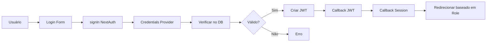

# Guia de Desenvolvimento - PósVendas Pro

Este documento contém informações técnicas detalhadas sobre a arquitetura, padrões e como estender o sistema.

## 📐 Arquitetura do Sistema

### Visão Geral

O PósVendas Pro segue uma arquitetura em camadas típica de aplicações Next.js modernas:

```
┌─────────────────────────────────────┐
│         Presentation Layer          │
│  (Pages, Components, UI)            │
├─────────────────────────────────────┤
│         API Layer                   │
│  (API Routes, Server Actions)       │
├─────────────────────────────────────┤
│         Business Logic Layer        │
│  (Services, Validations)            │
├─────────────────────────────────────┤
│         Data Access Layer           │
│  (Prisma, Database)                 │
└─────────────────────────────────────┘
```

### Decisões Técnicas

#### Por que Next.js App Router?

- **Server Components**: Melhor performance e SEO
- **Streaming**: Carregamento progressivo de conteúdo
- **Layouts aninhados**: Reutilização de UI
- **API Routes integradas**: Backend e frontend no mesmo projeto

#### Por que NextAuth.js v5?

- **Integração nativa**: Funciona perfeitamente com Next.js 14+
- **Type-safe**: Total suporte a TypeScript
- **Flexível**: Suporta múltiplos providers
- **Seguro**: Implementa best practices de segurança

#### Por que Prisma?

- **Type-safe**: Queries totalmente tipadas
- **Migrations**: Controle de versão do banco
- **Developer experience**: Excelente DX com autocomplete
- **Multi-database**: Fácil trocar de banco se necessário

## 🏗️ Estrutura de Pastas Detalhada

### `/app` - Rotas e Páginas

```
app/
├── admin/                    # Rotas protegidas para ADMIN
│   ├── empresas/            # Gestão de empresas
│   ├── page.tsx             # Dashboard principal
│   └── layout.tsx           # Layout com sidebar/topbar
├── dashboard/               # Rotas protegidas para CLIENT
│   ├── reclamacoes/        # Gestão de reclamações
│   ├── page.tsx            # Dashboard principal
│   └── layout.tsx          # Layout com sidebar/topbar
├── login/                  # Página pública de login
│   └── page.tsx
├── api/                    # API Routes
│   ├── auth/[...nextauth]/ # Endpoints NextAuth
│   └── companies/          # CRUD de empresas
└── page.tsx                # Página raiz (redirecionamento)
```

### `/components` - Componentes React

```
components/
├── ui/                     # Componentes base (shadcn/ui)
│   ├── button.tsx
│   ├── card.tsx
│   ├── input.tsx
│   └── ...
├── admin/                  # Componentes específicos admin
│   ├── sidebar.tsx
│   ├── topbar.tsx
│   ├── company-table.tsx
│   └── company-form.tsx
├── dashboard/              # Componentes específicos cliente
│   ├── sidebar.tsx
│   ├── topbar.tsx
│   └── complaints-table.tsx
├── login-form.tsx          # Formulário de login
└── sign-out-button.tsx     # Botão de logout
```

### `/services` - Lógica de Negócio

Serviços contêm toda a lógica de negócio e interações com banco/APIs:

```typescript
// Exemplo de estrutura de serviço
export async function createCompany(data: CreateCompanyData) {
  // 1. Validações de negócio
  // 2. Verificações de duplicidade
  // 3. Operações no banco
  // 4. Retorno tipado
}
```

**Princípios**:
- Funções puras quando possível
- Validação de dados de entrada
- Mensagens de erro descritivas
- Tratamento de exceções
- Retornos tipados

### `/lib` - Utilitários

Funções auxiliares e configurações:

```
lib/
├── prisma.ts          # Singleton Prisma Client
├── auth-utils.ts      # Hash, validação de senha
├── validations.ts     # Schemas Zod
└── utils.ts           # Funções gerais (cn, etc)
```

## 🔐 Autenticação e Autorização

### Fluxo de Autenticação



### Proteção de Rotas

A proteção de rotas é feita em **nível de componente** usando helpers:

```typescript
// app/admin/page.tsx
export default async function AdminPage() {
  await requireAdmin(); // Redireciona se não for ADMIN
  // ... resto do código
}
```

**Exemplo de uso** em uma página:

```typescript
import { requireAdmin } from '@/lib/auth-helpers';

export default async function MyAdminPage() {
  const session = await requireAdmin();
  // Se chegar aqui, é ADMIN garantido!
  // ...
}
```

**Helpers disponíveis** em `lib/auth-helpers.ts`:
- `requireAuth()` - Garante que está logado
- `requireAdmin()` - Garante role ADMIN
- `requireClient()` - Garante role CLIENT

### Estender Sessão com Dados Customizados

Para adicionar novos campos à sessão:

1. **Adicionar ao callback JWT** (`auth.ts`):
```typescript
async jwt({ token, user }) {
  if (user) {
    token.meuCampo = user.meuCampo;
  }
  return token;
}
```

2. **Adicionar ao callback Session** (`auth.ts`):
```typescript
async session({ session, token }) {
  session.user.meuCampo = token.meuCampo;
  return session;
}
```

3. **Atualizar tipos** (`types/next-auth.d.ts`):
```typescript
declare module 'next-auth' {
  interface Session {
    user: {
      meuCampo: string;
    } & DefaultSession['user'];
  }
}
```

## 🗄️ Banco de Dados

### Schema Prisma

O schema está organizado em seções:

1. **Autenticação**: User, Account, Session
2. **Multi-tenancy**: Company
3. **Integrações Futuras**: MlAccount, Complaint

### Migrations

```bash
# Criar nova migration
npx prisma migrate dev --name nome_da_migration

# Aplicar migrations em produção
npx prisma migrate deploy

# Resetar banco (DEV ONLY!)
npx prisma migrate reset
```

### Relacionamentos

```
Company (1) --> (*) User
Company (1) --> (*) MlAccount
Company (1) --> (*) Complaint
User (1) --> (*) Account
User (1) --> (*) Session
```

### Índices

Índices criados para otimização:
- `User.email` - Busca rápida no login
- `User.companyId` - Filtro por empresa
- `Complaint.companyId` - Filtro de reclamações
- `Complaint.status` - Filtro por status

## 🎨 Componentes UI

### shadcn/ui

Utilizamos shadcn/ui que copia componentes para o projeto (não é biblioteca):

**Vantagens**:
- Total controle sobre o código
- Customização completa
- Sem dependência externa
- Acessibilidade built-in

**Adicionar novo componente**:
```bash
npx shadcn@latest add nome-do-componente
```

### Padrões de Componentes

#### Server Components (padrão)

```typescript
// app/admin/page.tsx
export default async function AdminPage() {
  const data = await fetchData(); // OK em Server Component
  return <div>{data}</div>;
}
```

**Quando usar**: Sempre que possível (melhor performance)

#### Client Components

```typescript
'use client'; // Diretiva obrigatória no topo

import { useState } from 'react';

export function MyComponent() {
  const [state, setState] = useState();
  // ...
}
```

**Quando usar**: 
- Hooks (useState, useEffect, etc)
- Event handlers (onClick, onChange)
- Browser APIs
- Interatividade em geral

## 📝 Validação de Dados

### Zod Schemas

Todas as validações usam Zod:

```typescript
// lib/validations.ts
export const mySchema = z.object({
  name: z.string().min(3, 'Mínimo 3 caracteres'),
  email: z.string().email('E-mail inválido'),
});

export type MyInput = z.infer<typeof mySchema>;
```

### React Hook Form

Integração com Zod via `@hookform/resolvers`:

```typescript
const { register, handleSubmit, formState: { errors } } = useForm({
  resolver: zodResolver(mySchema),
});
```

## 🔌 Integrações Futuras

### Mercado Livre API

Estrutura preparada em `services/mercadolivre-service.ts`:

#### 1. OAuth Flow

```typescript
// Passo 1: Redirecionar usuário
const authUrl = getAuthorizationUrl(state);
redirect(authUrl);

// Passo 2: Callback recebe code
const { access_token, refresh_token } = await exchangeCodeForToken(code);

// Passo 3: Salvar tokens no banco
await prisma.mlAccount.create({
  data: {
    companyId,
    accessToken: encrypt(access_token), // Importante: criptografar!
    refreshToken: encrypt(refresh_token),
    expiresAt: new Date(Date.now() + 6 * 60 * 60 * 1000), // 6 horas
  },
});
```

#### 2. Sincronização de Reclamações

Implementar job periódico (cron):

```typescript
// Executar a cada hora
export async function syncComplaintsJob() {
  const companies = await prisma.company.findMany({
    include: { mlAccounts: { where: { isActive: true } } },
  });

  for (const company of companies) {
    for (const mlAccount of company.mlAccounts) {
      // Renovar token se expirado
      const token = await getValidToken(mlAccount);
      
      // Buscar reclamações
      const complaints = await getComplaints(token);
      
      // Sincronizar com banco
      await syncToDatabase(complaints, company.id);
    }
  }
}
```

#### 3. Webhooks (Recomendado)

Melhor que polling: receber eventos em tempo real:

```typescript
// app/api/webhooks/mercadolivre/route.ts
export async function POST(request: Request) {
  const body = await request.json();
  
  // Validar webhook signature
  if (!validateSignature(body, request.headers)) {
    return new Response('Unauthorized', { status: 401 });
  }
  
  // Processar evento
  if (body.topic === 'claims') {
    await handleComplaintUpdate(body);
  }
  
  return new Response('OK');
}
```

### Brevo (E-mail)

Estrutura preparada em `services/email-service.ts`:

#### Templates Recomendados

1. **Boas-vindas**: Novo usuário criado
2. **Recuperação de senha**: Reset password
3. **Nova reclamação**: Notificação de nova reclamação
4. **Reclamação resolvida**: Confirmação
5. **Relatório semanal**: Digest de atividades

#### Implementação

```typescript
import { sendEmail } from '@/services/email-service';

// Em qualquer lugar do código
await sendEmail({
  to: user.email,
  toName: user.name,
  subject: 'Bem-vindo!',
  htmlContent: '<h1>Olá!</h1>',
});
```

## 🧪 Testes (Futuro)

### Estrutura Recomendada

```
__tests__/
├── unit/
│   ├── services/
│   └── lib/
├── integration/
│   └── api/
└── e2e/
    └── flows/
```

### Ferramentas Sugeridas

- **Unit/Integration**: Jest + Testing Library
- **E2E**: Playwright ou Cypress
- **API**: Supertest

## 🚀 Performance

### Otimizações Implementadas

1. **Server Components**: Renderização no servidor
2. **Prisma Connection Pooling**: Reutilização de conexões
3. **Lazy Loading**: Componentes carregados sob demanda
4. **Image Optimization**: Next.js Image component

### Monitoramento Recomendado

- **Vercel Analytics**: Performance web
- **Prisma Pulse**: Database insights (pago)
- **Sentry**: Error tracking
- **LogRocket**: Session replay

## 📊 Boas Práticas

### Commits

```
feat: adiciona filtro de reclamações
fix: corrige bug no login
docs: atualiza README
refactor: melhora estrutura de serviços
test: adiciona testes de API
```

### Código

- ✅ Componentes pequenos e focados
- ✅ Funções puras quando possível
- ✅ Comentários em código complexo
- ✅ Tipos explícitos (evitar `any`)
- ✅ Tratamento de erros consistente
- ✅ Validação de dados sempre

### Segurança

- ✅ Senhas sempre hasheadas (bcrypt)
- ✅ Tokens JWT com secret forte
- ✅ Validação de entrada (Zod)
- ✅ Proteção CSRF (NextAuth)
- ✅ Rate limiting em APIs (implementar)
- ✅ HTTPS em produção sempre

## 🐛 Debugging

### Logs do Prisma

```typescript
// lib/prisma.ts
const prisma = new PrismaClient({
  log: ['query', 'error', 'warn'], // Ver todas as queries
});
```

### NextAuth Debug

```typescript
// auth.ts
export default NextAuth({
  debug: process.env.NODE_ENV === 'development',
  // ...
});
```

### Variáveis de Ambiente

```bash
# .env.local
NODE_ENV=development
NEXTAUTH_DEBUG=true
```

## 📚 Recursos Úteis

- [Next.js Docs](https://nextjs.org/docs)
- [NextAuth.js Docs](https://next-auth.js.org/)
- [Prisma Docs](https://www.prisma.io/docs)
- [shadcn/ui](https://ui.shadcn.com/)
- [Tailwind CSS](https://tailwindcss.com/)
- [Zod](https://zod.dev/)
- [ML Developers](https://developers.mercadolivre.com.br/)

## 🤝 Contribuindo

1. Crie uma branch descritiva
2. Faça commits pequenos e frequentes
3. Escreva mensagens de commit claras
4. Teste localmente antes do PR
5. Documente mudanças significativas
6. Peça code review

---

**Mantenha este documento atualizado conforme o projeto evolui!**

